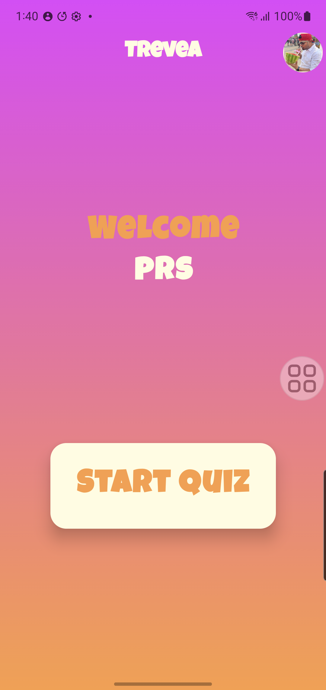
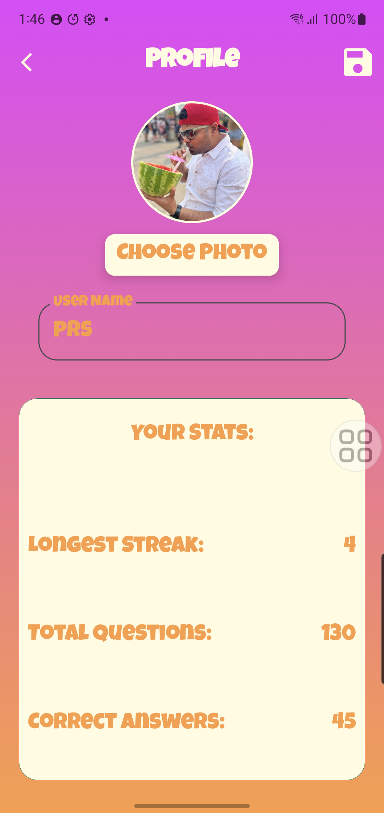
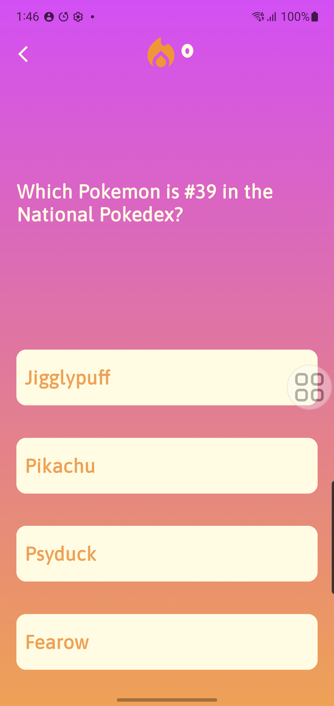

# Trevea — Trivia Quiz App

A modern Android trivia quiz application built with Jetpack Compose and Kotlin, featuring real-time questions from the Open Trivia Database API.

---

## Screenshots

<p float = "left">
    
    
    
</p>

---

## Features

- Browse trivia categories from Open Trivia Database
- Configure quiz by category and difficulty
- Continuous question stream with background polling
- Answer feedback with correct/incorrect highlighting
- User profile with name and photo
- Persistent user stats — total questions, correct answers, longest streak
- Category preferences saved locally
- Offline-first architecture with local caching
- Adaptive layout — portrait and landscape support

---

## Tech Stack

| Category | Technology |
|---|---|
| Language | Kotlin |
| UI | Jetpack Compose + Material3 |
| Architecture | MVVM + Clean Architecture |
| Networking | Retrofit + OkHttp |
| Local Storage | Room + DataStore Preferences |
| Image Loading | Coil |
| Async | Kotlin Coroutines + Flow + StateFlow |
| Navigation | Navigation Compose |
| Dependency Injection | Manual DI (ViewModelFactory) |
| Minimum SDK | 24 (Android 7.0) |
| Target SDK | 37 |

---

## Architecture

Trevea follows **MVVM (Model-View-ViewModel)** architecture with a clean separation of concerns:

```
UI Layer (Jetpack Compose)
    ↕  collectAsStateWithLifecycle()
ViewModel Layer
    ↕  suspend functions + Flow
Repository Layer
    ↕                    ↕
Remote (Retrofit)    Local (Room + DataStore)
    ↕
Open Trivia DB API
```

## Package Structure

```
com.learn.android.trevea/
├── data/
│   ├── local/
│   │   ├── dao/
│   │   │   └── UserCategoryDao
│   │   ├── database/
│   │   │   └── AppDatabase
│   │   ├── preferences/
│   │   │   └── UserPreferences
│   │   └── repository/
│   │       ├── UserPreferenceRepository
│   │       └── UserRepository
│   ├── model/
│   │   └── Category
│   └── remote/
│       ├── model/
│       │   └── otdb/
│       │       ├── OtdbCategoryResponse
│       │       └── QuizResponse
│       ├── repository/
│       │   └── OtdbRepository
│       ├── retrofit/
│       │   └── RetrofitInstance
│       └── service/
│           └── OtdbApiService
├── navigation/
│   └── AppNavController
├── ui/
│   ├── components/
│   ├── screens/
│   │   ├── HomeScreen
│   │   ├── ProfileScreen
│   │   ├── QuizConfigScreen
│   │   └── QuizScreen
│   └── theme/
├── utils/
└── viewmodel/
    ├── profile/
    │   ├── ProfileViewModel
    │   └── ProfileViewModelFactory
    ├── quiz/
    │   ├── QuizViewModel
    │   └── QuizViewModelFactory
    ├── quizConfig/
    │   ├── QuizConfigViewModel
    │   └── QuizConfigViewModelFactory
    └── stats/
        └── UserStatsViewModel
```

---

## API

Trevea uses the [Open Trivia Database](https://opentdb.com) — a free, public trivia API requiring no authentication.

| Endpoint | Purpose |
|---|---|
| `/api_category.php` | Fetch all trivia categories |
| `/api.php` | Fetch questions by category and difficulty |

---

## Local Data Storage

| Data | Storage | Details |
|---|---|---|
| User name | DataStore | String preference |
| Profile photo | Internal storage + DataStore | File copied locally, path stored |
| User stats | DataStore | Int preferences (streak, totals) |
| Category preferences | Room | `user_categories` table |

---

## Getting Started

### Prerequisites

- Android Studio Hedgehog or later
- Android device or emulator running API 24+
- Internet connection for trivia questions

### Installation

1. Clone the repository
```bash
git clone https://github.com/prs-sharma9/notes-app-dont-judge.git
```

2. Open in Android Studio

3. Build and run on your device or emulator

No API keys required — OpenTDB is a free public API.

---

## What I Learned Building This

This project was built as a learning exercise covering:

- **Jetpack Compose** — declarative UI, state hoisting, recomposition, animations
- **MVVM architecture** — separating UI, business logic, and data concerns
- **Kotlin Coroutines and Flow** — async operations, cold vs hot streams, StateFlow vs SharedFlow
- **Retrofit** — REST API integration, JSON mapping with Gson, OkHttp interceptors
- **Room** — local database, DAOs, entity relationships
- **DataStore** — modern SharedPreferences replacement for key-value storage
- **Navigation Compose** — multi-screen navigation, argument passing, back stack management
- **Reactive programming** — driving UI entirely from observable state streams
- **Android lifecycle** — lifecycle-aware collection, ViewModel scoping

---

## License

```
MIT License — feel free to use this project for learning purposes
```
